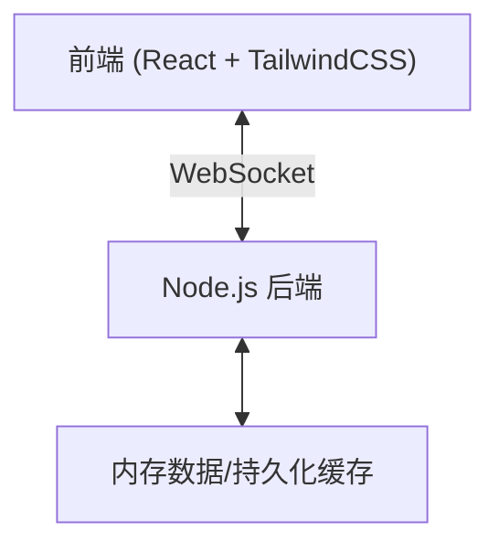
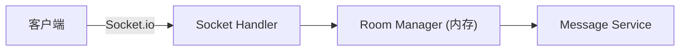
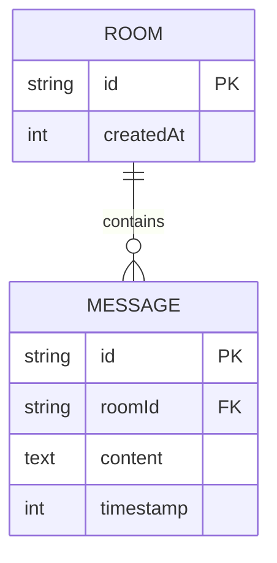

## 1. 架构设计


## 2. 技术说明
- **前端**：React@18 + tailwindcss@3 + vite
  - 状态管理：React Hooks (useState, useEffect)
  - 时间处理：原生 `Intl.DateTimeFormat`，保证时间戳的精确显示
  - 图标：lucide-react
  - 实时通信：`socket.io-client`
- **后端**：Node.js + Express + `socket.io` (用于实时双向同步)
  - 存储：由于是轻量级传参需求，首选内存数组配合定时清理机制（例如24小时清理一次）以达到极速响应。如需防止重启丢失，可用轻量级的 JSON 文件或 `sqlite3`。本项目考虑到轻量与易部署，采用 `Map` 在内存中维护房间状态，并记录精确的时间戳。
- **初始化工具**：Vite（用于前端快速构建）

## 3. 路由定义 (前端)
| 路由 | 描述 |
|------|------|
| `/` | 首页，生成随机口令，或输入口令加入房间 |
| `/room/:id` | 同步工作区页面，包含参数输入框和历史记录列表 |

## 4. API / WebSocket 定义
**WebSocket 事件 (Socket.io)**：
- `join_room`：客户端发送房间号加入。服务器返回当前房间的历史消息。
- `new_message`：客户端发送新参数，服务器广播给同房间的其他客户端。
- `history`：服务器主动下发该房间的全部历史记录。

**数据结构**：
```typescript
interface Message {
  id: string;
  roomId: string;
  content: string;
  timestamp: number; // 毫秒级时间戳
}
```

## 5. 服务端架构图


## 6. 数据模型
### 6.1 数据模型定义

*注：本项目后端将主要采用内存存储，以简化部署并提升读写速度，该ER图映射到后端的 `Map<roomId, Message[]>` 数据结构中。*
