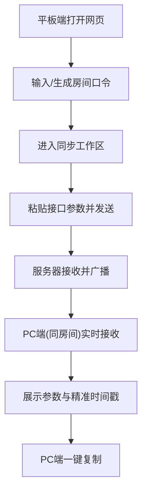

## 1. 产品概述
本项目是一个轻量、精美的在线参数同步网站，专为解决平板电脑与 PC 端之间接口参数复制粘贴不便的问题而设计。
通过提供极简的剪贴板同步服务，用户可以在平板上粘贴长文本（如 JSON 参数、API 请求体等），PC 端打开同个房间即可实时可见，并配有精准到毫秒的时间戳记录。

## 2. 核心功能

### 2.1 用户角色
| 角色 | 注册方式 | 核心权限 |
|------|----------|----------|
| 普通用户 | 无需注册（基于随机生成的房间号或口令） | 创建/加入房间，发送文本，复制历史文本 |

### 2.2 功能模块
1. **首页入口**：生成专属同步房间号，或输入已有房间号进入同步空间。
2. **同步工作区**：大面积文本输入区、发送按钮、实时同步的历史记录列表（带精准时间戳和一键复制功能）。

### 2.3 页面详细说明
| 页面名称 | 模块名称 | 功能描述 |
|----------|----------|----------|
| 首页 | 房间入口 | 输入或随机生成一个同步口令（如4位短码），进入专属同步工作区 |
| 工作区 | 输入模块 | 大面积的文本输入框，支持快速粘贴，提供“发送”按钮 |
| 工作区 | 历史记录 | 列表展示历史同步的参数，每条记录显示精准到秒/毫秒的时间戳，并提供“一键复制”功能 |
| 工作区 | 状态指示 | 显示当前 WebSocket 连接状态（如“已连接”、“同步中”），保证同步的可靠性 |

## 3. 核心流程
用户在平板端打开网页 -> 自动生成/输入房间号进入 -> 在文本框粘贴参数并发送 -> PC 端打开同房间网页 -> 实时看到最新参数并一键复制。

## 4. 用户界面设计
### 4.1 设计风格
- **整体基调**：现代极简主义（Modern Minimalist），注重排版与空间感，拒绝繁杂装饰，以内容（参数）为核心。
- **色彩规范**：
  - 主背景色：纯净的浅灰白（#FAFAFC）或深邃的暗夜黑（支持暗黑模式）。
  - 主色调：克制的强调色（如青石蓝 #0A84FF 或 翡翠绿 #30D158），用于发送和复制按钮。
  - 文本色：高对比度但柔和的深灰（#1C1C1E）。
- **字体**：使用系统级无衬线字体（Inter, SF Pro, 或 PingFang SC），时间戳与参数代码区使用等宽字体（Monaco, JetBrains Mono 或 Fira Code）以保证对齐与代码美感。
- **组件样式**：大圆角（12px - 16px），细腻的弥散阴影，毛玻璃效果（Glassmorphism）用于顶部导航或浮动提示。
- **动效**：列表新增条目时的平滑展开动画，复制成功后的微反馈动效（如打勾动画、轻微缩放）。

### 4.2 页面设计概览
| 页面名称 | 模块名称 | UI元素设计 |
|----------|----------|------------|
| 首页 | 房间入口 | 屏幕中央居中的卡片，包含大字号的输入框和优雅的渐变进入按钮 |
| 工作区 | 布局 | 桌面端左右分栏（左输入，右历史），移动/平板端上下流式布局（上输入，下历史） |
| 工作区 | 历史卡片 | 纯白卡片，悬浮时微微抬起，右上角为等宽字体的时间戳，右下角为悬浮可见的一键复制按钮 |

### 4.3 响应式设计
采用桌面优先兼顾平板/移动端的流式布局。特别针对平板（iPad）进行触控优化：输入框触控区域足够大，按钮间距合理，防止误触。
